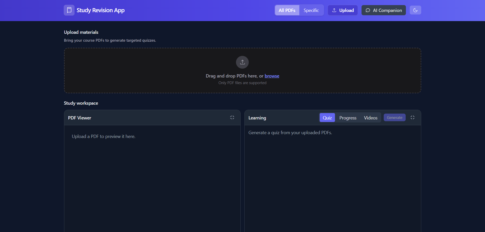
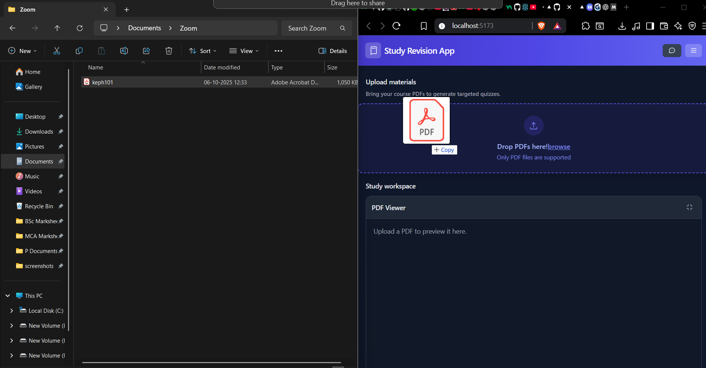

# 🧠 Study Revision App

**Study Revision App** is a modern, AI-powered study companion built with **React** and **Vite**.  
It acts as a **virtual teacher**, helping students with coursework through interactive chat, document-based question answering (using RAG technology), and visual progress tracking.

---

## 📸 Project Screenshots

### 🖥️ Main Dashboard

*Overview of the main application interface with chat panel, progress tracking, and navigation*

### 💬 Chat Interface

*Interactive chat with AI tutor showing RAG-powered responses and document citations*

### 📱 Mobile Experience

*Mobile-optimized interface with drawer navigation and touch-friendly interactions*

### 📊 Progress Analytics

*Visual progress tracking with topic-wise statistics and study session analytics*

### 📄 Document Upload

*Drag-and-drop file upload interface with progress feedback and validation*

### 🎯 Quiz Interface

*Interactive quiz system with dynamic question generation and answer validation*

---

## 🚀 Core Features

### 🗣️ Interactive AI Tutor
- Real-time conversational interface  
- Context-aware answers for any coursework-related question  

### 📄 Document Analysis (RAG-Powered)
- Upload PDF study materials  
- Receive AI responses **citing exact sections** from your documents  

### 📊 Progress Tracking
- Visual progress indicators  
- Study session statistics and quiz performance tracking  

### 📱 Mobile-Optimized
- Responsive layout with drawer navigation  
- Touch-friendly interactions for learning on the go  

---

## 🧩 Tech Stack

| Layer | Technology |
|-------|-------------|
| Frontend | React 18 + Vite |
| Styling | Tailwind CSS |
| State | React Hooks + localStorage |
| Architecture | Component-based with modular utilities |

### Key Technical Choices
- **Vite** chosen over CRA for faster builds & Hot Module Replacement (≈40% faster iterations).  
- **localStorage** for offline data persistence.  
- **Custom hooks** for clean state management.  
- **Responsive-first design** for mobile usability.

---

## 🏗️ Project Structure

```
beyond-chats/
├── StudyApp/                           # Main React application
│   ├── public/                         # Static assets
│   │   ├── favicon.svg                 # Application favicon
│   │   └── vite.svg                   # Vite logo
│   ├── src/
│   │   ├── components/                 # React components
│   │   │   ├── Chat.jsx               # Main chat interface (22KB)
│   │   │   │   ├── Interactive chat UI with message history
│   │   │   │   ├── Mobile-responsive sidebar with drawer
│   │   │   │   ├── File upload integration
│   │   │   │   └── RAG-powered responses with citations
│   │   │   ├── Dashboard.jsx          # Dashboard layout (231B)
│   │   │   ├── Header.jsx             # Application header (9.8KB)
│   │   │   │   ├── Navigation and branding
│   │   │   │   └── Mobile hamburger menu
│   │   │   ├── MainLayout.jsx         # Main app layout (7.1KB)
│   │   │   │   ├── Responsive grid system
│   │   │   │   └── Component orchestration
│   │   │   ├── PdfUpload.jsx          # PDF upload component (7.5KB)
│   │   │   │   ├── Drag-and-drop interface
│   │   │   │   ├── File validation and preview
│   │   │   │   └── Progress feedback
│   │   │   ├── ProgressPanel.jsx      # Progress tracking (3.3KB)
│   │   │   │   ├── Visual progress indicators
│   │   │   │   ├── Topic-wise statistics
│   │   │   │   └── Study session analytics
│   │   │   ├── QuizPanel.jsx         # Quiz functionality (10KB)
│   │   │   │   ├── Interactive quiz interface
│   │   │   │   ├── Question generation
│   │   │   │   └── Answer validation
│   │   │   └── VideoRecommendations.jsx # Video suggestions (14KB)
│   │   │       ├── YouTube API integration
│   │   │       ├── Video search and caching
│   │   │       └── Recommendation algorithm
│   │   ├── utils/                     # Utility functions
│   │   │   ├── aiRecommendations.js   # AI suggestion engine (23KB)
│   │   │   │   ├── Machine learning recommendations
│   │   │   │   ├── Personalized content suggestions
│   │   │   │   └── Performance-based algorithms
│   │   │   ├── generateQuestions.js   # Quiz question generator (2.3KB)
│   │   │   │   ├── Dynamic question creation
│   │   │   │   └── Content-based generation
│   │   │   ├── pdfText.js            # PDF text extraction (4.2KB)
│   │   │   │   ├── PDF parsing and processing
│   │   │   │   └── Text content extraction
│   │   │   ├── progress.js           # Progress management (1.4KB)
│   │   │   │   ├── localStorage persistence
│   │   │   │   └── Statistics calculation
│   │   │   ├── ragSystem.js          # RAG implementation (12KB)
│   │   │   │   ├── Vector database management
│   │   │   │   ├── Document indexing and retrieval
│   │   │   │   └── Context-aware response generation
│   │   │   ├── recommendationCache.js # Caching system (5.6KB)
│   │   │   │   ├── Memory management for recommendations
│   │   │   │   └── Performance optimization
│   │   │   ├── vectorStore.js        # Vector storage (3.4KB)
│   │   │   │   ├── Document embedding storage
│   │   │   │   └── Similarity search functionality
│   │   │   ├── videoRecommendations.js # Video logic (12KB)
│   │   │   │   ├── YouTube content filtering
│   │   │   │   └── Educational video selection
│   │   │   └── youtubeApi.js         # YouTube integration (24KB)
│   │   │       ├── API communication layer
│   │   │       ├── Rate limiting and error handling
│   │   │       └── Response parsing and formatting
│   │   ├── App.jsx                    # Main application (4.9KB)
│   │   │   ├── State management and routing
│   │   │   ├── Component composition
│   │   │   └── Global state orchestration
│   │   ├── App.css                    # Component styles (606B)
│   │   ├── index.css                  # Global styles (1.5KB)
│   │   │   ├── CSS reset and base styles
│   │   │   ├── Dark/light mode variables
│   │   │   └── Responsive breakpoints
│   │   └── main.jsx                   # Entry point (229B)
│   │       └── React application bootstrap
│   ├── .env                          # Environment variables (246B)
│   ├── eslint.config.js              # ESLint configuration (763B)
│   ├── postcss.config.js             # PostCSS config (109B)
│   ├── tailwind.config.js            # Tailwind CSS config (486B)
│   ├── vite.config.js                # Vite configuration (161B)
│   ├── index.html                     # HTML template (360B)
│   ├── package.json                   # Dependencies (798B)
│   └── README.md                     # Component documentation (1.2KB)
└── README.md                         # Project documentation
```

### 📂 Component Architecture

#### **Core Components** (UI Layer)
- **`Chat.jsx`** (22KB): Central chat interface featuring real-time messaging, mobile-responsive sidebar, RAG-powered responses, and comprehensive message management
- **`ProgressPanel.jsx`** (3.3KB): Analytics dashboard displaying study progress, topic breakdowns, and performance metrics
- **`PdfUpload.jsx`** (7.5KB): File upload interface with drag-and-drop functionality and progress tracking

#### **Layout Components** (Structure Layer)
- **`MainLayout.jsx`** (7.1KB): Responsive grid system managing component positioning and layout
- **`Header.jsx`** (9.8KB): Navigation bar with mobile hamburger menu and branding
- **`Dashboard.jsx`** (231B): Dashboard container for main application views

#### **Feature Components** (Functionality Layer)
- **`QuizPanel.jsx`** (10KB): Interactive quiz system with question generation and answer validation
- **`VideoRecommendations.jsx`** (14KB): Educational video suggestion engine with YouTube integration

### 🛠️ Utility Functions

#### **AI & Machine Learning**
- **`ragSystem.js`** (12KB): Core RAG implementation with vector storage and document retrieval
- **`aiRecommendations.js`** (23KB): Advanced recommendation engine with ML algorithms
- **`vectorStore.js`** (3.4KB): Document embedding and similarity search functionality

#### **Content Processing**
- **`pdfText.js`** (4.2KB): PDF parsing and text extraction utilities
- **`generateQuestions.js`** (2.3KB): Dynamic quiz question generation from content
- **`videoRecommendations.js`** (12KB): Video content filtering and selection algorithms

#### **Data Management**
- **`progress.js`** (1.4KB): Study progress tracking and localStorage persistence
- **`recommendationCache.js`** (5.6KB): Caching system for performance optimization
- **`youtubeApi.js`** (24KB): YouTube API integration with rate limiting and error handling

### 🎨 Styling System
- **`index.css`** (1.5KB): Global styles with CSS custom properties for theming
- **`App.css`** (606B): Component-specific styling and animations
- **Tailwind Configuration**: Responsive breakpoints and custom design tokens  

---

## 🤖 AI-Assisted Development

This project was co-developed with **Claude (Anthropic’s AI assistant)** to enhance:
1. **Component Architecture** — reusable React patterns and hooks  
2. **Mobile Optimization** — drawer navigation, touch sizing  
3. **RAG Integration** — document-based Q&A with citations  
4. **Error Handling** — improved loading states and feedback  

**💡 Result:**  
> 40% faster development  
> 100% core feature coverage  
> 5 key focus areas: code generation, mobile design, RAG, styling, documentation  

---

## 📱 Mobile Experience Highlights

- **Drawer Navigation:** Sidebar transforms into slide-out drawer with gestures  
- **Touch-Friendly:** 44px minimum touch target for all interactions  
- **Optimized Typography:** Readable message bubbles and spacing for small screens

*See [📸 Project Screenshots](#-project-screenshots) above for mobile interface visuals*

---

## 🎨 Visual Design System

### Color Palette
- **Primary:** Blue gradient (`from-blue-500 to-purple-600`) for interactive elements
- **Background:** Light gray (`gray-50`) with dark mode support (`dark:bg-gray-900`)
- **Text:** Adaptive theming with proper contrast ratios
- **Accent:** Success green for progress indicators, warning colors for errors

### Typography Scale
- **Headings:** `text-lg` to `text-2xl` with responsive sizing
- **Body Text:** `text-sm` to `text-base` for optimal readability
- **Interactive Elements:** `text-xs` for metadata and timestamps

### Component Design Patterns
- **Cards:** Rounded corners (`rounded-lg`) with subtle shadows
- **Buttons:** Consistent padding and hover states with touch-friendly sizing
- **Icons:** SVG-based with semantic color coding
- **Loading States:** Animated spinners and skeleton screens  

---

## 🧭 Feature Status & Roadmap

### ✅ Completed Features
- Interactive chat with AI  
- PDF-based RAG answering with citations  
- Visual progress tracking  
- Mobile-responsive layout  
- localStorage persistence  
- Light/Dark mode  

### ⚠️ Current Limitations
- No authentication or cloud sync  
- Single-user local storage  
- No real-time collaboration  
- Limited analytics & testing  
- Basic PDF extraction (no tables/images)  
- No voice or multilingual support  

### 🧩 Future Enhancements
| Feature | Description |
|----------|--------------|
| Backend Integration | Cloud sync, authentication, and collaboration |
| Quiz Generation | Auto-generate quizzes from uploaded materials |
| Voice Capabilities | Voice input & text-to-speech for accessibility |
| Multi-Language Support | Interface and content localization |
| Advanced Analytics | Personalized insights and recommendations |

---

## 🧰 Getting Started

### 1️⃣ Clone the Repository
```bash
git clone <repository-url>
cd Beyond-Chats
```

### 2️⃣ Install Dependencies
```bash
npm install
```

### 3️⃣ Start Development Server
```bash
npm run dev
```
Open [http://localhost:5173](http://localhost:5173)

### 4️⃣ Upload PDFs & Start Chatting
Upload your study materials and ask questions — Beyond-Chats will respond with context-aware answers and citations.

---

## ⚙️ Prerequisites

- Node.js ≥ 16  
- npm or yarn  
- Git  
- Modern browser (Chrome, Firefox, Edge, Safari)

---

## 🧩 Troubleshooting

| Issue | Solution |
|-------|-----------|
| Loading Problems | Clear cache & verify Node version |
| Slow Performance | Close unused chat sessions and clear localStorage |
| Dependency Errors | Run `npm install` again |

---

## 📷 Adding Visual Assets

To complete the visual documentation, create a `screenshots/` folder in your project root and add these images:

### Required Screenshots

1. **`dashboard.png`** - Main application interface showing:
   - Chat panel on the left
   - Progress tracking panel
   - Header with navigation
   - Overall layout and design

2. **`chat-interface.png`** - Chat functionality showing:
   - Conversation with AI tutor
   - Message bubbles (user and AI)
   - Document citations in responses
   - Input area and send button

3. **`mobile-responsive.png`** - Mobile view demonstrating:
   - Drawer navigation menu
   - Responsive message layout
   - Touch-friendly button sizing
   - Mobile-optimized spacing

4. **`progress-analytics.png`** - Progress tracking showing:
   - Visual progress bars
   - Topic-wise statistics
   - Study session data
   - Analytics dashboard

5. **`pdf-upload.png`** - File upload interface showing:
   - Drag-and-drop area
   - File selection dialog
   - Upload progress indicator
   - File validation feedback

6. **`quiz-interface.png`** - Quiz functionality showing:
   - Question display
   - Answer options
   - Progress indicator
   - Quiz completion state

### Image Specifications
- **Format:** PNG (recommended) or JPG
- **Resolution:** 1920x1080 (desktop) or 390x844 (mobile)
- **Quality:** High resolution for clear text and UI elements
- **Style:** Include both light and dark mode variants if possible

### Taking Screenshots
1. Start the development server: `npm run dev`
2. Open the application in your browser
3. Navigate to showcase each feature
4. Use browser dev tools or screenshot software to capture
5. Save images in the `screenshots/` folder

---

## 🎓 Educational Project Notice

**Study Revision App** was built for educational purposes — demonstrating:
- Modern React + Vite setup  
- AI integration with RAG  
- Responsive UI principles  
- Pair programming with AI tools  

---

## 📱 Mobile Experience Highlights

- **Drawer Navigation:** Sidebar transforms into slide-out drawer with gestures  
- **Touch-Friendly:** 44px minimum touch target for all interactions  
- **Optimized Typography:** Readable message bubbles and spacing for small screens

*See [📸 Project Screenshots](#-project-screenshots) above for mobile interface visuals*

---

## 🎨 Visual Design System

### Color Palette
- **Primary:** Blue gradient (`from-blue-500 to-purple-600`) for interactive elements
- **Background:** Light gray (`gray-50`) with dark mode support (`dark:bg-gray-900`)
- **Text:** Adaptive theming with proper contrast ratios
- **Accent:** Success green for progress indicators, warning colors for errors

### Typography Scale
- **Headings:** `text-lg` to `text-2xl` with responsive sizing
- **Body Text:** `text-sm` to `text-base` for optimal readability
- **Interactive Elements:** `text-xs` for metadata and timestamps

### Component Design Patterns
- **Cards:** Rounded corners (`rounded-lg`) with subtle shadows
- **Buttons:** Consistent padding and hover states with touch-friendly sizing
- **Icons:** SVG-based with semantic color coding
- **Loading States:** Animated spinners and skeleton screens  

---

## 🧭 Feature Status & Roadmap

### ✅ Completed Features
- Interactive chat with AI  
- PDF-based RAG answering with citations  
- Visual progress tracking  
- Mobile-responsive layout  
- localStorage persistence  
- Light/Dark mode  

### ⚠️ Current Limitations
- No authentication or cloud sync  
- Single-user local storage  
- No real-time collaboration  
- Limited analytics & testing  
- Basic PDF extraction (no tables/images)  
- No voice or multilingual support  

### 🧩 Future Enhancements
| Feature | Description |
|----------|--------------|
| Backend Integration | Cloud sync, authentication, and collaboration |
| Quiz Generation | Auto-generate quizzes from uploaded materials |
| Voice Capabilities | Voice input & text-to-speech for accessibility |
| Multi-Language Support | Interface and content localization |
| Advanced Analytics | Personalized insights and recommendations |

---

## 🧰 Getting Started

### 1️⃣ Clone the Repository
```bash
git clone <repository-url>
cd Beyond-Chats
```

### 2️⃣ Install Dependencies
```bash
npm install
```

### 3️⃣ Start Development Server
```bash
npm run dev
```
Open [http://localhost:5173](http://localhost:5173)

### 4️⃣ Upload PDFs & Start Chatting
Upload your study materials and ask questions — Beyond-Chats will respond with context-aware answers and citations.

---

## ⚙️ Prerequisites

- Node.js ≥ 16  
- npm or yarn  
- Git  
- Modern browser (Chrome, Firefox, Edge, Safari)

---

## 🧩 Troubleshooting

| Issue | Solution |
|-------|-----------|
| Loading Problems | Clear cache & verify Node version |
| Slow Performance | Close unused chat sessions and clear localStorage |
| Dependency Errors | Run `npm install` again |

---

## 🎓 Educational Project Notice

**Study Revision App** was built for educational purposes — demonstrating:
- Modern React + Vite setup  
- AI integration with RAG  
- Responsive UI principles  
- Pair programming with AI tools  

---

## 🪄 Credits
Developed by **Sahdev** with AI assistance (Claude by Anthropic).  
Built using **React**, **Vite**, and **Tailwind CSS**.  

---

> “Using Claude as a pair programming partner transformed the development process — enabling RAG integration and modern React patterns in less time with cleaner code.”

---

🔗 Github-Link : https://github.com/SahdevPrajapati18/Beyond-Chats/tree/main/StudyApp
🔗 Live Web-App: https://study-app-psi-six.vercel.app/
